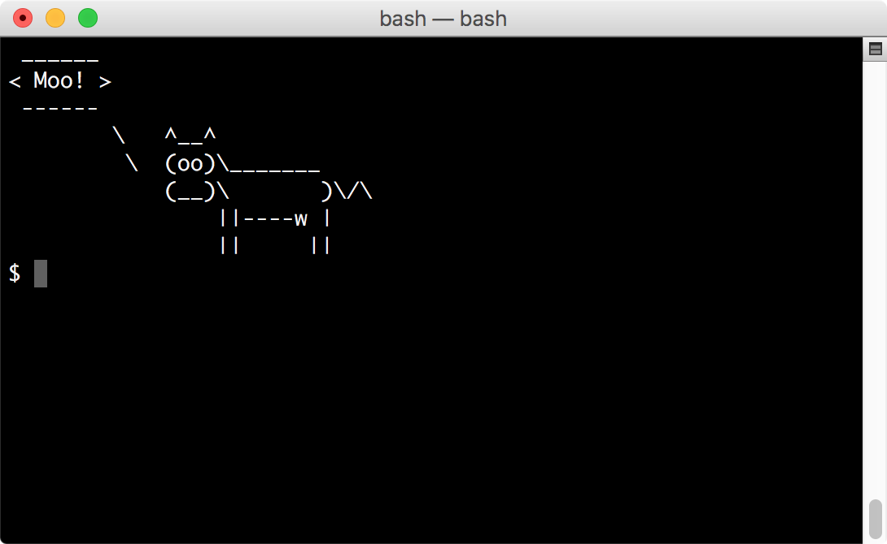

# cowsay-org/cowsay Homebrew Tap



This is a tap for Mac Homebrew. The formulae in it provide the cowsay utility, along with alternate implementations of it and auxiliary packages that work with it.

This tap is part of the cowsay-apj project, a modern fork of cowsay. The main apjanke/cowsay project repo is at <https://github.com/cowsay-org/cowsay>.

For info about Mac Homebrew, see [brew.sh](https://brew.sh).

## How do I install these formulae?

```bash
brew install cowsay-org/cowsay/cowsay-apj
```

Or:

```bash
brew tap cowsay-org/cowsay
brew install cowsay-apj
```

## Troubleshooting

First read the [Homebrew Troubleshooting Checklist](https://github.com/Homebrew/brew/blob/master/share/doc/homebrew/Troubleshooting.md#troubleshooting).

Use `brew gist-logs <formula>` to create a [Gist](https://gist.github.com/) and post the link in your issue.

Search [open](https://github.com/cowsay-org/homebrew-cowsay/issues?state=open) and [closed](https://github.com/cowsay-org/homebrew-cowsay/issues?state=closed) issues. See also Homebrew's  [Common Issues](https://github.com/Homebrew/brew/blob/master/share/doc/homebrew/Common-Issues.md) and [FAQ](https://github.com/Homebrew/brew/blob/master/share/doc/homebrew/FAQ.md).

## Documentation

`brew help`, `man brew` or check [Homebrew's documentation](https://github.com/Homebrew/brew/tree/master/share/doc/homebrew#readme).
